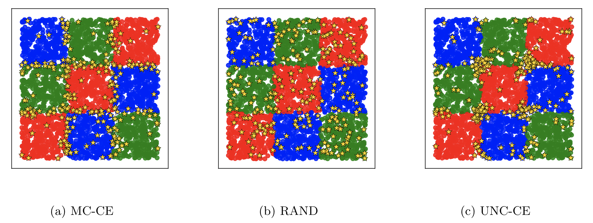
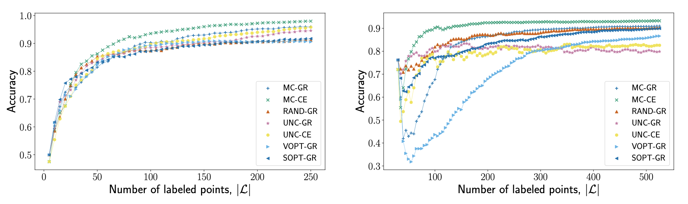

# Model Change Active Learning Paper
## (To Appear)

Python code for doing active learning in graph-based semi-supervised learning (GBSSL) paradigm. Implements testing done in my paper that will soon appear and be submitted for peer-review.

## Usage

To run tests in this framework, edit ``run_experiments_binary.py`` or ``run_experiments_multiclass.py`` to 
* hard-code ``DATA_FILEPATH`` variable to specify where your ``*.npz`` file is located.
* specify which acquisition functions (with their corresponding underlying GBSSL model) to test in the list variable ``acq_models``
* possible choices in ``acq_models``:
  * __acquisitions functions__ : ``mc`` (Model Change), ``uncertainty`` (Uncertainty), ``vopt`` (VOpt), ``sopt`` ($\Sigma$Opt), ``rand`` (Random)
  * __binary models__ : ``gr`` (Gaussian Regression), ``log`` (Logistic Loss), ``probitnorm`` (Probit - Normal)
  * __multiclass models__ : ``gr``(Gaussian Regression), ``ce`` (Cross-Entropy)
  * Separate __acquisition function__ and __model__ with double-dash: e.g. ``mc--gr`` --> Model Change acquisition function in Gaussian Regression Model.

## Results in Paper
Example plots from code in ``results/Checkerboard Figures.ipynb`` and ``results/Accuracy Figures.ipynb``. 

* Stars represent the choices of the different acquisition functions on the Checkerboard 3 dataset. Notice how our Model Change criterion selects points in all of the squares and then refines on the true square boundaries.

* Notice how our Model Change criterion reaches a higher overall accuracy faster than the other methods we tried. The plots shows the results the Checkerboard 3 dataset (left) and MNIST dataset (right).
