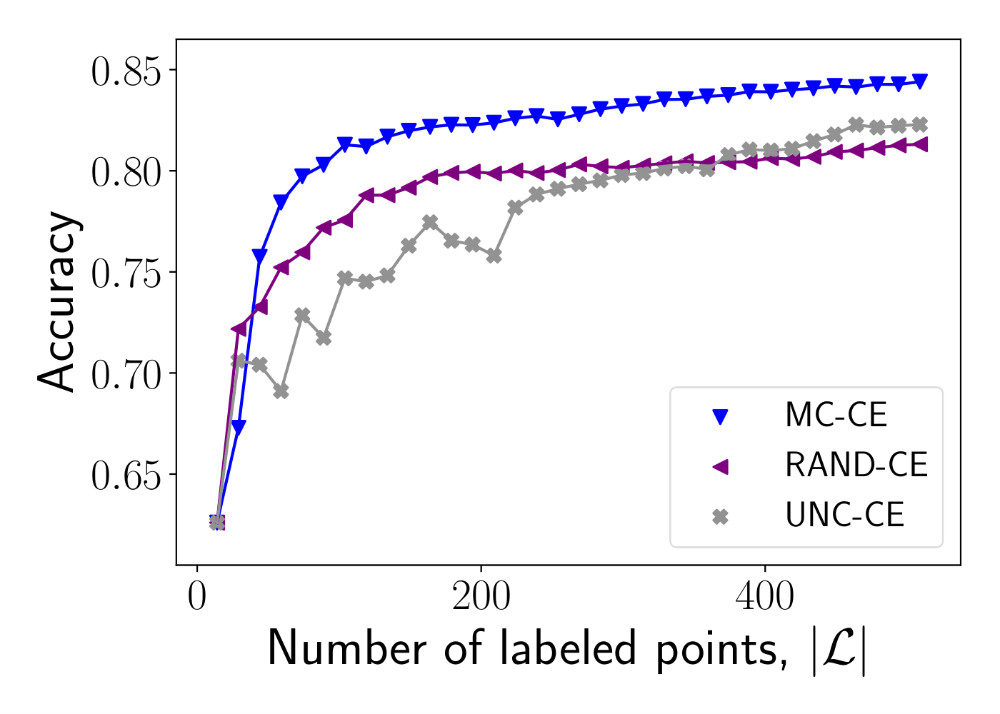

# Model Change Active Learning Paper
## (To Appear)

Python code for doing active learning in graph-based semi-supervised learning (GBSSL) paradigm. Implements testing done in paper that will soon appear and be submitted for peer-review.

## Usage

To run tests in this framework, run scripts ``bin_run.py`` or ``multi_run.py`` specifying location (``--data-root``) of ``.npz`` file that contains variables ``X`` (N x d numpy array) and ``labels`` (N vector numpy array). Default is hard-coded in the scripts to run on all possible acquisition functions, but can change the list variable ``acq_models``
* possible choices for ``acq_models``:
  * __acquisitions functions__ : ``mc`` (Model Change), ``uncertainty`` (Uncertainty), ``vopt`` (VOpt), ``sopt`` (SigmaOpt), ``rand`` (Random)
  * __binary models__ : ``gr`` (Gaussian Regression), ``log`` (Logistic Loss), ``probitnorm`` (Probit - Normal)
  * __multiclass models__ : ``gr``(Gaussian Regression), ``ce`` (Cross-Entropy)
  * Separate __acquisition function__ and __model__ with double-dash: e.g. ``mc--gr`` --> Model Change acquisition function in Gaussian Regression Model.

### Simple Self-Contained Test

Can simply run test on the synthetic dataset "Binary Clusters" presented in the paper:

``` python binary_clusters_run.py --al-iters 100 --B 1 # run sequential active learning on binary clusters data for 100 active learning iterations```

```python binary_clusters_run.py --al-iters 20 --B 5 # run batch activate learning on binary clusters data for 20 active learning iterations```

## Results in Paper
Example plots from code in ``results/acc_figures.py``
#### Multiclass Gaussian Regression
MNIST           |  Salinas A       | Urban 
:-------------------------:|:-------------------------:|:-------------------------:
 |   | 

#### Cross-Entropy 
MNIST           |  Salinas A       | Urban 
:-------------------------:|:-------------------------:|:-------------------------:
 |   | 

